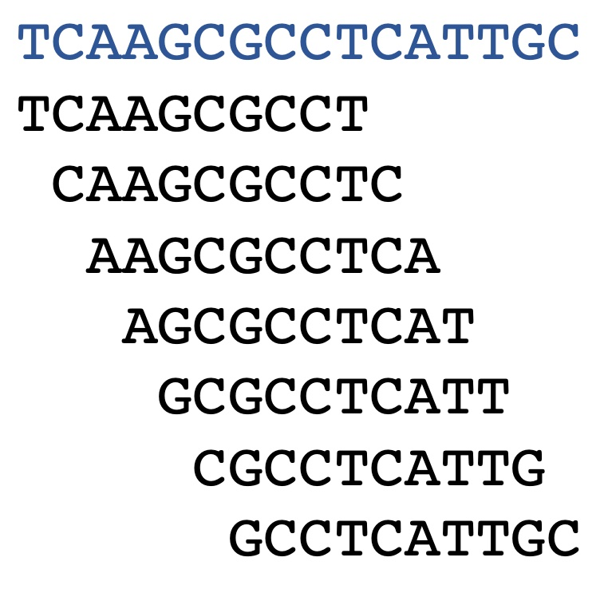
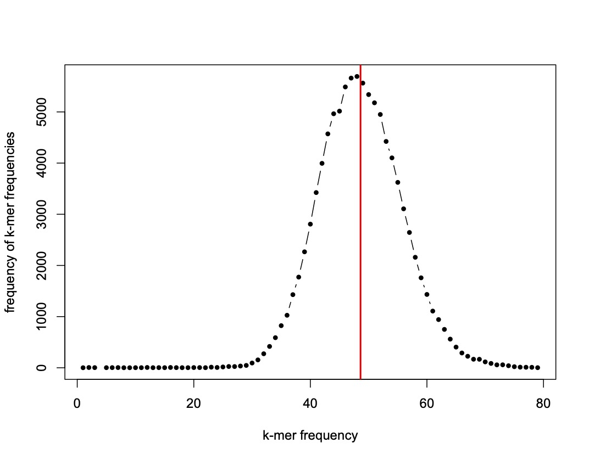
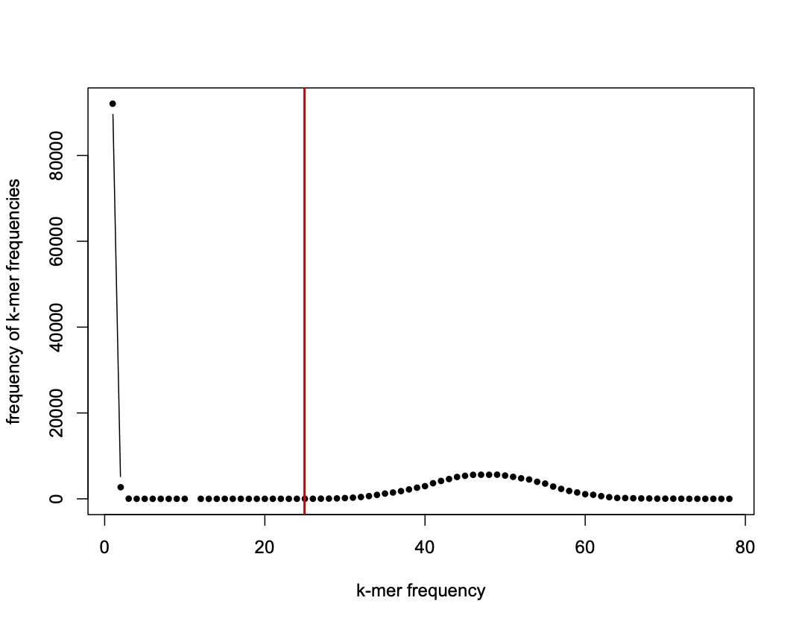
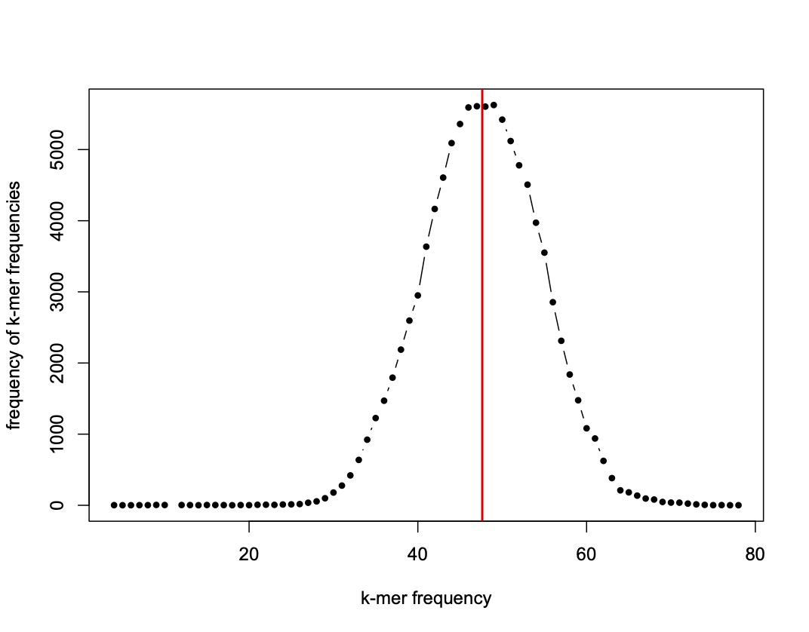
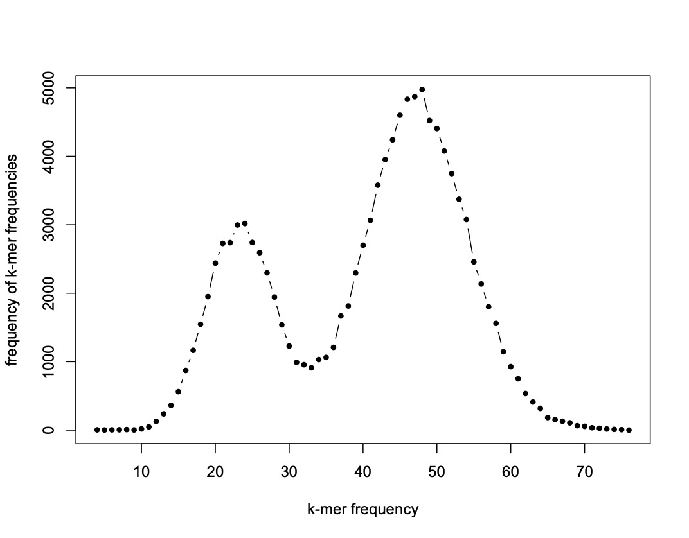

# Estimating genome size from raw, unassembled sequencing data

When doing genome sequencing projects, something we often want to know _a priori_, but don't, is the approximate size of the genome. We can get an estimate of this from raw, unassembled sequencing data provided the coverage is high enough and the error rate is low enough (you can't use nanopore reads for this!)

There are a few ways to do this. We'll illustrate the basic concept first and how features of real data complicate things, and then move on to using a piece of software called `GenomeScope`. 

When sequencing a genome, some key numbers are the size  of the haploid genome (let's call that G), the total number of bases sequenced by the researcher (call that Bn) and the sequencing coverage, or the expected number of times each base in the genome has been sequenced (call that Cb). Consider that: 

Cb = Bn/G

We can easily tally up Bn. But is there a way to learn C and thus figure out G without having an assembled genome? Yes, sort of, by using the k-mer frequency spectrum! k-mers are simply sequences of length k. The k-mer frequency spectrum is the frequency (fc) of k-mers with frequency (fk) in a set of sequences. To calculate this from a set of sequences:

    1. Chop up each sequence into every possible subsequence of length k. 
    2. Calculate the frequency (fk) of each unique k-mer. 
    3. Calculate the frequency (fc) of the frequencies of k-mers (fk). 

This can be a little confusing because the k-mer frequency spectrum gives the frequency of frequencies of k-mers, but this is key so take a moment to wrap your brain around it. To make it a little more concrete, consider this 16bp sequence and its 10bp k-mers below:



To get all 10-mers from that sequence, simply take each substring from bases 1-10,2-11,... This results in 16 - 10 + 1 = 7 k-mers, each one unique. So fk looks like this because each k-mer occurs only once:

| k-mer      | frequency |
| ---------- | ---|
| TCAAGCGCCT | 1 |
| CAAGCGCCTC | 1 |
| AAGCGCCTCA | 1 |
| AGCGCCTCAT | 1 |
| GCGCCTCATT | 1 |
| CGCCTCATTG | 1 |
| GCCTCATTGC | 1 |


And fc, the k-mer frequency spectrum looks like this, because the frequency 1 appears 7 times:

| k-mer frequency | frequency |
| ---------- | ---|
| 1 | 7 |

If you were to chop up a real genome in this way, some k-mers would appear many times because genomes usually contain repetitive sequences. However, for k-mer values in the 20s and above, only a few k-mers will occur multiple times at random. For random sequences at equal base frequencies, the probability of any single k-mer of k=21 is 4^-21 = 2.2 * 10^-13. 

So any given sequence of length G has Kn = G - Kl + 1 k-mers of length Kl. For typical focal k-mer lengths of 15-30bp and genomes in the millions to billions of bases, the number of bases in the (haploid) genome, G, is approximately equal to the number of k-mers. 

Above, we discussed decomposing a genome into constituent k-mers. What we want to do, however, is infer genome length from a collection of unassembled sequence data. 

For a collection of Rn short reads of uniform length Rl, the number of k-mers that can be extracted is Knr = Rn * (Rl - Kl + 1). When dealing with sequencing data, which can generally come from either strand, _canonical_ k-mers are usually considered. For canonical k-mers, sequences and their reverse complements are equivalent. So AGAG and CTCT form a single canonical 4-mer. There are half as many canonical k-mers, but at k=21, the probability of sampling them multiple times by chance is still low. 

Ok, so once we chop up our sequencing data and get this k-mer spectrum (more about that shortly), how do we figure out the length, G, of our genome? 

First we have to take one more short step. Above we noted that Cb = Bn/G. With our k-mer spectrum we can come up with an analog: 

Ck = KnS/Kn. 

The expected frequency (or coverage) of a genomic k-mer in our sequencing data (Ck) equals the total number of k-mers in the sequencing data (KnS) divided by the number of k-mers in the genome. As we noted above, as long as we're working with short k-mer lengths and large genomes, Kn is about equal to the genome length. 

So, finally, let's look at how we learn Ck from the k-mer spectrum. 

In an ideal world, where we have no sequencing bias, no sequencing error, and no heterozygosity, we can simply calculate the average Ck is the average k-mer frequency. This is the mean of fk. If we do a simple simulation of a 100kb genome with 100bp reads at 60x coverage and k=21, our k-mer spectrum looks like this (the following figures were generated by simulating data in `R` using this script [kmer_sim.R](kmer_sim.R)): 



The mean k-mer frequency is the red line, at 48.60924, right on par with the expected frequency, and right about at the peak of the distribution. So with KnS = 60,000 * (100-20+1) = 4860000 and Ck = 48.60924, we get Kn = 99,981. 

If we incorporate sequencing error, things get dramatically different. This is the same simulation with a 0.001% base error rate:



Sequencing error produces many rare k-mers, leading to the spike at low frequencies in the spectrum. This lowers the average dramatically to 24 and leads to an overestimate of genome size at 194kb. The peak of the distribution is still near 48.6 though, implying that we could simply exclude these low frequency k-mers and recalculate. 



Indeed, we recover a Ck of 47 and wind up with an estimate of 99,994. 

What about when we have heterozygosity in a diploid organism? Things get more complicated still:



Now we see two peaks. The left peak corresponds to k-mers overlapping heterozygous sites. Their frequency is cut in half compared to expectations. The right peak corresponds to homozygous k-mers. If we use the right peak as Ck, we would recover the true genome size. 

There are many further complications to consider, like repetitive elements, organellar DNA, ploidy > 2, and biases in sequencing, so it is useful to use a more complex method that has been developed to model all these aspects of k-mer frequency spectrum implemented in `GenomeScope`. This has the added advantage that it allows you to estimate the fraction of single-copy DNA, the level of heterozygosity, and the sequencing error rate. 

## Genome profiling using `GenomeScope` and `jellyfish`

When we have a real dataset, we can do this analysis in three steps. First, count k-mers, second count k-mer frequencies, and finally, model the k-mer spectrum. We'll do steps one and two in `jellyfish` and step 3 in `GenomeScope`.  

### Counting k-mers

Below is a script (including a SLURM header for UConn's Xanadu cluster) that was used to count k-mers for a plant with a 320mb genome sequenced to 80x coverage on the Illumina platform:

```bash
#!/bin/bash
#SBATCH --job-name=jf21
#SBATCH -N 1
#SBATCH -n 1
#SBATCH -c 30
#SBATCH --partition=himem
#SBATCH --qos=himem
#SBATCH --mail-type=END
#SBATCH --mem=475G
#SBATCH -o jf21_%j.out
#SBATCH -e jf21_%j.err

module load jellyfish/2.2.6
jellyfish count -t 30 -C -m 21 -s 100G -o 21mer_out *fastq
```

This script invokes `jellyfish count` and uses 30 processors (`-t 30`) to count canonical k-mers (`-C`) of length 21 (`-m 21`). We specify an initial hash size of 100gb, but jellyfish can expand that if necessary. In the SLURM header we request 475gb of memory, as k-mer counting in a large dataset can be very memory intensive. We used `*fastq` to match all fastq files in the current directory, but you can also write them out explicitly as the last arguments in the script. 

### Counting k-mer frequencies

Below is a script (including a SLURM header for UConn's Xanadu cluster) that was used to tally up k-mer count frequencies (i.e. make the k-mer frequency spectrum): 

```bash
#!/bin/bash
#SBATCH --job-name=jf21-h
#SBATCH -N 1
#SBATCH -n 1
#SBATCH -c 8
#SBATCH --partition=general
#SBATCH --qos=general
#SBATCH --mail-type=END
#SBATCH --mem=5G
#SBATCH -o jf21-h_%j.out
#SBATCH -e jf21-h_%j.err

module load jellyfish/2.2.6

jellyfish histo -o 21mer_out.histo 21mer_out
```

This script invokes `jellyfish histo` and provides the output file from the previous step. It requires much fewer processors and less memory than the intial counting. 


